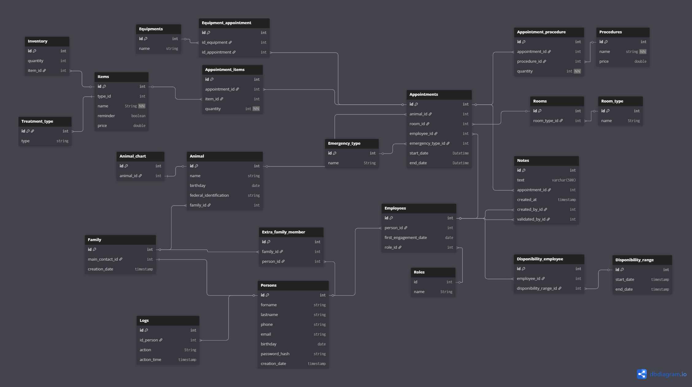

# 🐾 Vet Software

A comprehensive veterinary clinic management system to streamline the entire workflow of a vet clinic.

## Project Overview

This system helps veterinary clinics manage appointments, patient records, treatments, and administrative tasks efficiently.

## Tech Stack

- **Backend**: Django 6.0 (Python)
- **Database**: SQLite (development) / PostgreSQL (production ready)
- **Frontend**: Tailwind CSS 3.x + Flowbite
- **Testing**: pytest, pytest-django, pytest-cov
- **Build Tools**: Node.js, npm

## Quick Start

For detailed installation and setup instructions, please see [CONTRIBUTING.md](CONTRIBUTING.md).

**Prerequisites**: Python 3.10+, Node.js 20.x LTS, Git

**Quick access after setup**:

- Main site: http://127.0.0.1:8000/
- Admin panel: http://127.0.0.1:8000/admin/

## Project Structure

```
vet-software/
├── src/                    # Django project source
│   ├── home/              # Main application
│   │   ├── templates/     # HTML templates
│   │   ├── views.py       # View functions
│   │   └── urls.py        # URL routing
│   ├── vet_software/      # Project settings
│   │   └── settings.py    # Django configuration
│   └── manage.py          # Django management script
├── static/                # Static assets
│   ├── src/
│   │   ├── input.css      # Tailwind source
│   │   └── output.css     # Compiled CSS (generated)
│   └── tailwind.config.js # Tailwind configuration
├── docs/                  # Documentation
├── venv/                  # Virtual environment
└── requirements.txt       # Python dependencies

```

## SQL SCHEMA

[DB Diagram link](https://dbdiagram.io/d/692583c97d9416ddff01868e)



**SQL dumps :** can be found [here](./db).

## Authors

**Aurélie Pham** • **Grace Naing** • **Karel Vilém Svoboda**

**Affiliation**: HES-SO Valais / Wallis (2025-2026)

**Courses**: 201.2 Génie logiciel • 201.3 BD relationnelles

## License

See [LICENSE](LICENSE) file for details.
